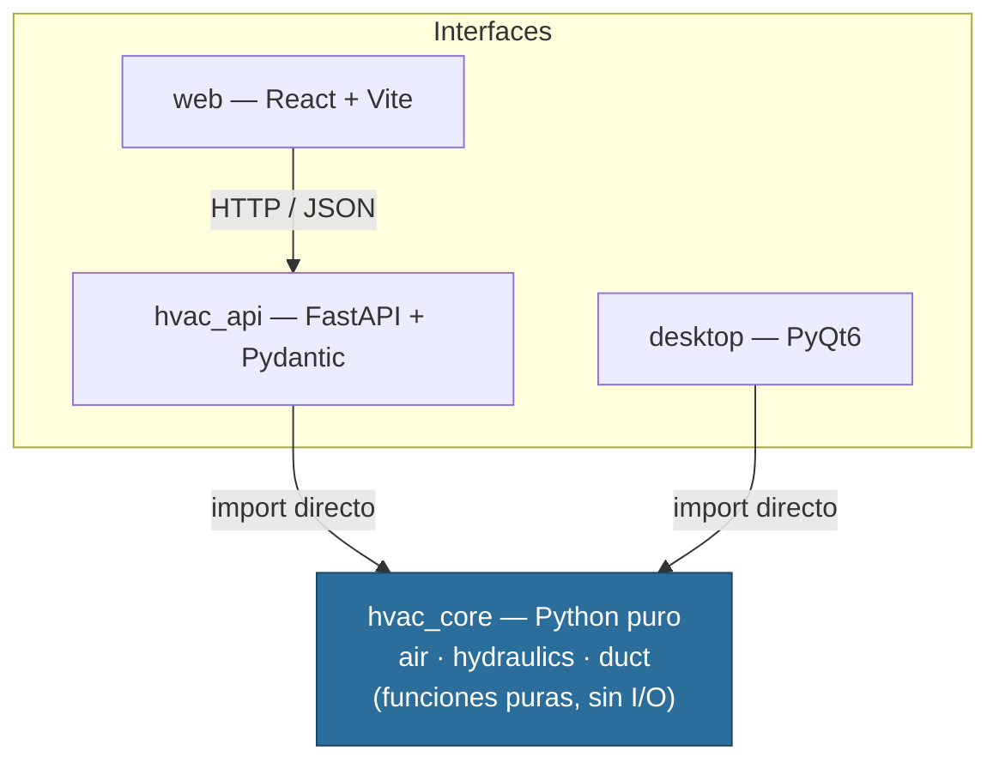

# DuctFlow

**Calculadora de dimensionado de conductos de aire HVAC por el método de fricción constante.**

Un mismo motor de cálculo en Python puro (`hvac_core`), desacoplado de toda interfaz, expuesto como **API REST (FastAPI)** y consumido por dos frontends independientes: una **app web (React + Vite)** y una **app de escritorio (PyQt6)**.

---

## ¿Qué hace y para qué sirve?

Dado un **caudal de aire** (m³/s) y una **pérdida de carga objetivo** (Pa/m), DuctFlow calcula el **diámetro de conducto redondo** necesario, junto con la **velocidad** y el **número de Reynolds** resultantes.

Es el cálculo que un ingeniero HVAC hace a diario para dimensionar redes de conductos: el **método de fricción constante**, donde se fija una pérdida de carga por metro y se busca el diámetro que la produce. Sirve para diseñar instalaciones de ventilación y climatización con una caída de presión controlada y uniforme.

Ejemplo: un caudal de `0.5 m³/s` con una pérdida objetivo de `0.8 Pa/m` da un conducto de **0.356 m** de diámetro, con una velocidad de **5.02 m/s** y `Re ≈ 118.751`.

---

## ¿Por qué está armado así? (el corazón del proyecto)

La decisión de diseño central es la **separación tajante entre el motor de cálculo y la interfaz**. Toda la física vive en un paquete de Python puro, `hvac_core`, que **no importa FastAPI, ni PyQt, ni React** — no sabe que existe ninguna interfaz. Las tres capas exteriores dependen del core; el core no depende de nadie.



Las flechas de dependencia **apuntan siempre hacia el centro**. Esto trae:

- **Reutilización real del core.** La app web (vía HTTP) y la app de escritorio (vía import directo) ejecutan exactamente la misma lógica de cálculo, sin duplicar una sola línea de física. Las capturas de más abajo lo prueban: misma entrada, mismo resultado, dos interfaces distintas.
- **Testeabilidad.** Como el core son funciones puras (sin estado global, sin I/O, sin prints), se testea de forma trivial con `pytest`.
- **Escalabilidad.** Sumar una CLI, un notebook o un nuevo frontend es agregar otro adaptador que llama al core; el core no se toca.

Esta es una invariante verificable del proyecto:

```bash
grep -rn "fastapi\|PyQt\|react" hvac_core/   # debe devolver vacío
```

---

## ¿Qué física hay abajo?

El cálculo combina física clásica de mecánica de fluidos, sin dependencias numéricas externas (solo la librería estándar `math`):

- **Propiedades del aire** (`air.py`): densidad por ley de gas ideal (`ρ = P / (R·T)`, con `R = 287.058 J/kg·K`) y viscosidad dinámica por la **ley de Sutherland**. La viscosidad cinemática se deriva como `ν = μ / ρ`.
- **Pérdida de carga** (`hydraulics.py`): ecuación de **Darcy-Weisbach** para la caída de presión por metro.
- **Factor de fricción**: ecuación de **Colebrook-White**, resuelta por **iteración de punto fijo** con semilla de Swamee-Jain (régimen turbulento), o `64/Re` en régimen laminar. Sin SciPy: robusta y autocontenida.
- **Solver de diámetro** (`solve_diameter_for_friction`): **bisección** sobre el rango `[0.03 m, 3.0 m]`, aprovechando que la pérdida por metro decrece monótonamente con el diámetro. Si la pérdida objetivo no es alcanzable en el rango, lanza `ValueError` (caso imposible) — un error de dominio que la API traduce a HTTP 422 y el escritorio muestra en pantalla sin crashear.

La rugosidad por defecto es `0.00009 m` (chapa galvanizada).

---

## Estructura del repositorio

```
ductflow/
├── hvac_core/          # Motor de cálculo. Python puro, sin dependencias de UI.
│   ├── __init__.py     #   API pública del paquete.
│   ├── air.py          #   air_at() → densidad (gas ideal) + viscosidad (Sutherland).
│   ├── hydraulics.py   #   reynolds, colebrook_white, pressure_loss_per_meter,
│   │                   #   solve_diameter_for_friction (bisección).
│   └── duct.py         #   DuctSizingInput, DuctSizingResult, size_round_duct (caso de uso).
├── hvac_api/           # Adaptador FastAPI sobre el core.
│   ├── schemas.py      #   SizingRequest / SizingResponse (Pydantic).
│   └── main.py         #   Endpoint POST + CORS + traducción ValueError → HTTP 422.
├── web/                # Frontend React (Vite) que consume la API por HTTP.
│   └── src/App.jsx
├── desktop/            # App de escritorio PyQt6 que importa el core directamente.
│   └── app.py
├── tests/              # Tests del core con pytest.
│   └── test_core.py
└── requirement.txt     # Dependencias: fastapi, uvicorn[standard], pydantic, PyQt6, pytest.
```

---

## La API

`POST /api/round-sizes`

Entrada (`SizingRequest`):

| Campo             | Tipo  | Default | Descripción                   |
|-------------------|-------|---------|-------------------------------|
| `flow_rate_m3s`   | float | —       | Caudal [m³/s] (> 0)           |
| `target_pa_per_m` | float | `0.8`   | Pérdida objetivo [Pa/m] (> 0) |
| `air_temp_c`      | float | `20`    | Temperatura del aire [°C]     |

Salida (`SizingResponse`): `diameter_m`, `velocity_ms`, `reynolds`.

Un caudal o una pérdida fuera de rango devuelve **HTTP 422** con el mensaje del error de dominio. CORS está habilitado para el origen del dev server de Vite (`http://localhost:5173`).

---

## ¿Cómo lo corro?

Desde `ductflow/`, con un entorno virtual activado e instaladas las dependencias:

```bash
pip install -r requirement.txt
```

**Tests del core**

```bash
pytest -v
```

**API (terminal 1)**

```bash
uvicorn hvac_api.main:app --reload
# Documentación interactiva en http://localhost:8000/docs
```

**Frontend web (terminal 2, desde `ductflow/web/`)**

```bash
npm install
npm run dev
# http://localhost:5173
```

**App de escritorio**

```bash
python desktop/app.py
```

---

## ¿Qué se ve?

La misma entrada (`0.5 m³/s`, `0.8 Pa/m`) produce el mismo resultado en ambas interfaces — la prueba visual del desacople: dos frontends, un solo core.

**App web (React + Vite → API FastAPI → core)**


**App de escritorio (PyQt6 → core por import directo)**


---

## Stack

Python · FastAPI · Pydantic · PyQt6 · React · Vite · pytest
